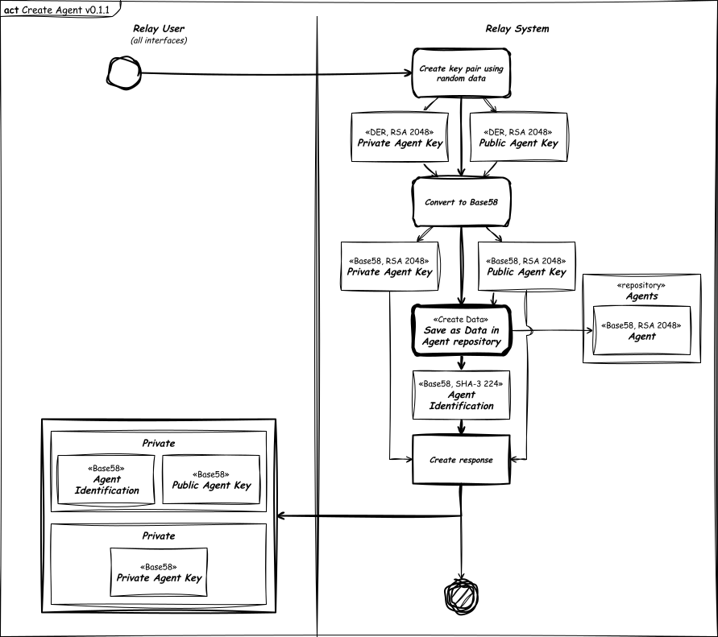
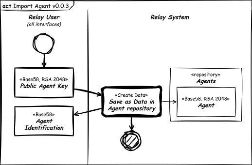

# Agent Features

## Legend

- The diagrams is conform SysML standard.
- Sketched diagrams indicate view not implemented.
- The thicker flow lines (double thickness) indicate preferred flow.
- The dashed flow lines indicate dependency (depends on).
- The blocks with shadow and thicker edges (double thickness) indicate input/output interfaces.
- The blocks even thicker edges (quadruple thickness) indicate default activity or link to other diagram.

## Create Agent

## Import Agent

