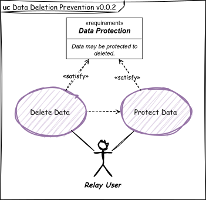
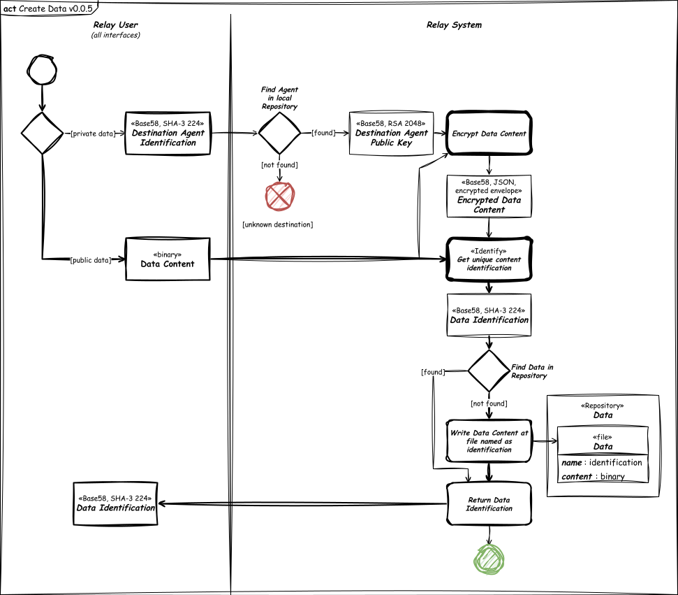
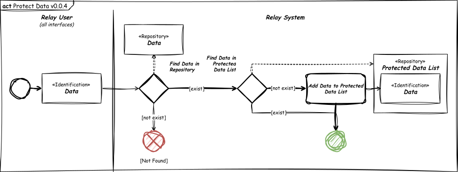
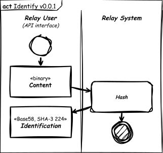
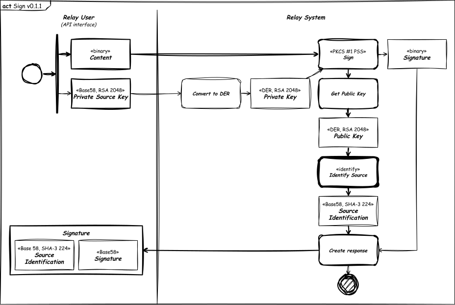

# Legend

- The diagrams is conform SysML standard.
- Sketched diagrams indicate view not implemented.
- The thicker flow lines (double thickness) indicate preferred flow.
- The dashed flow lines indicate dependency (depends on).
- The blocks with shadow and thicker edges (double thickness) indicate input/output interfaces.
- The blocks even thicker edges (quadruple thickness) indicate default activity or link to other diagram.

# Use Cases

## Main Features

## Data Deletion Prevention

# Activities

## Agent Features

### Create Agent

### Import Agent

## Data Features

### Import Data

### Create Data

### Read Data

### Delete Data

### Protect Data

## Internal Features

### Encrypt

### Decrypt

### Identify

### Sign

