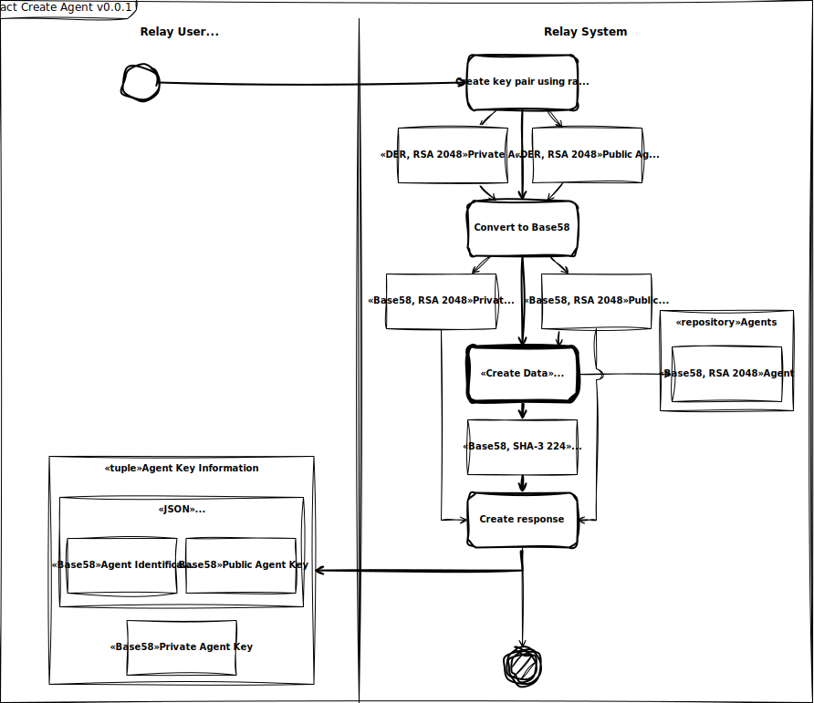
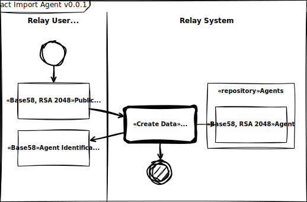
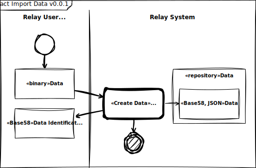

# Resume

- Views based in collection of ontological path defined by user;
- Assign ontological paths to files;
- Views signed by agent;
- Agent based in asymmetric keys (RSA 2048 key pair);
- Agent identification based in pubic key only;
- Prevent data duplication: using files named by your own hash (SHA-3 224);
- Data corruption verification: using files named by your own hash (SHA-3 224);
- Native encryption: encrypt, decrypt (AES 256 bits over RSA 2048 bits), sign and verify (RSA 2048 bits) data;
- Network nodes defined by shared node list.

# Main Use Case

## Create Agent

## Import Agent

## Import Data

