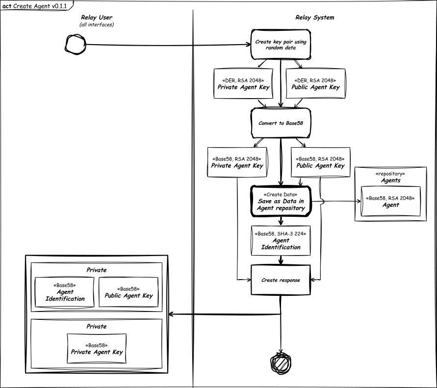
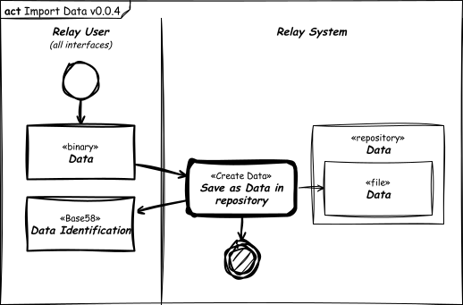

# Resume

- Views based in collection of ontological path defined by user;
- Assign ontological paths to files;
- Views signed by agent;
- Agent based in asymmetric keys (RSA 2048 key pair);
- Agent identification based in pubic key only;
- Prevent data duplication: using files named by your own hash (SHA-3 224);
- Data corruption verification: using files named by your own hash (SHA-3 224);
- Native encryption: encrypt, decrypt (AES 256 bits over RSA 2048 bits), sign and verify (RSA 2048 bits) data;
- Network nodes defined by shared node list.

## Legend

- The diagrams is conform SysML standard.
- Sketched diagrams indicate view not implemented.
- The thicker flow lines (double thickness) indicate preferred flow.
- The dashed flow lines indicate dependency (depends on).
- The blocks with shadow and thicker edges (double thickness) indicate input/output interfaces.
- The blocks even thicker edges (quadruple thickness) indicate default activity or link to other diagram.

# Main Use Case

## Create Agent

## Import Agent

## Import Data

## Create Data

