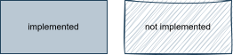
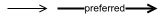
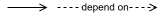
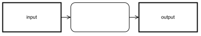
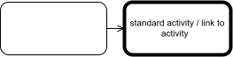
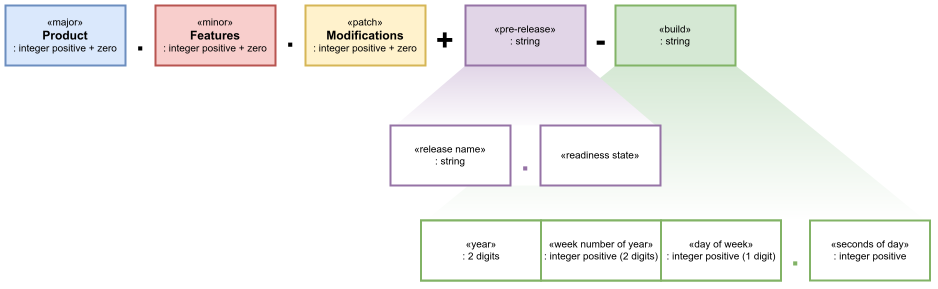
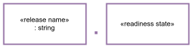
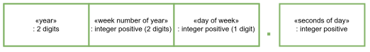

# Documentation Definitions

The definition above are used in all documentation.

- The diagrams are conform SysML standard (https://sysml.org/)
- Sketched diagrams indicate view not implemented.
    
    

- The thicker flow lines (double thickness) indicate preferred flow.

    

- The dashed flow lines indicate dependency (depends on).

    

- The blocks with shadow and thicker edges (double thickness) indicate input/output interfaces.

    

- The blocks even thicker edges (quadruple thickness) indicate default activity or link to other diagram.

    

# Version Scheme

The version is composed according SEMVER (https://semver.org).

## Pre-Releases

The **pre-release** is composed by tokens separated by dot (`.`):

- **Release**
- **Readiness** (last token) according Simplest Technology Readiness Level (https://dhbmarcos.gitlab.io/strl)

## Build

Product build instant code.

Specification of build value:
- First five digits:
    - digits 1 and 2: year of build;
    - digits 3 and 4: week number of build;
    - digit  5:       day of week of build;
- separator (`.`);
- Second from start of day;
