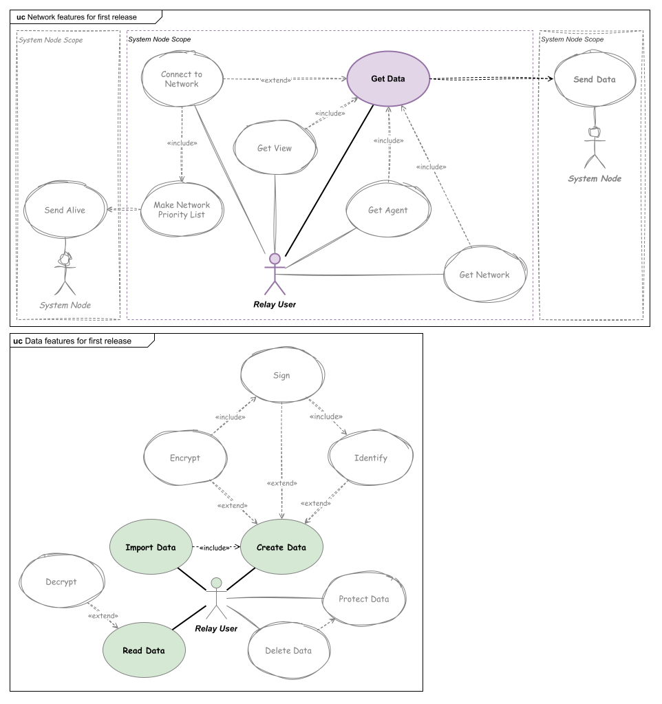

# Releases Plan

## First Release

 - Allow data swap using a private network.
 - The data will not be encrypted.
 - The connection and data transmission will use local file system.

See more at https://gitlab.com/dhbmarcos/data-relay/-/milestones/1

### Troubleshooting

#### Remote Connections 

To Remote connection use SSHFS.
A CLI interface will be developed to help create SSHFS connections.

#### Encrypted Content 

To encrypt and decrypt content use OpenSSL.
A CLI interface will be developed to help encrypt and decrypt using a symmetric key.
